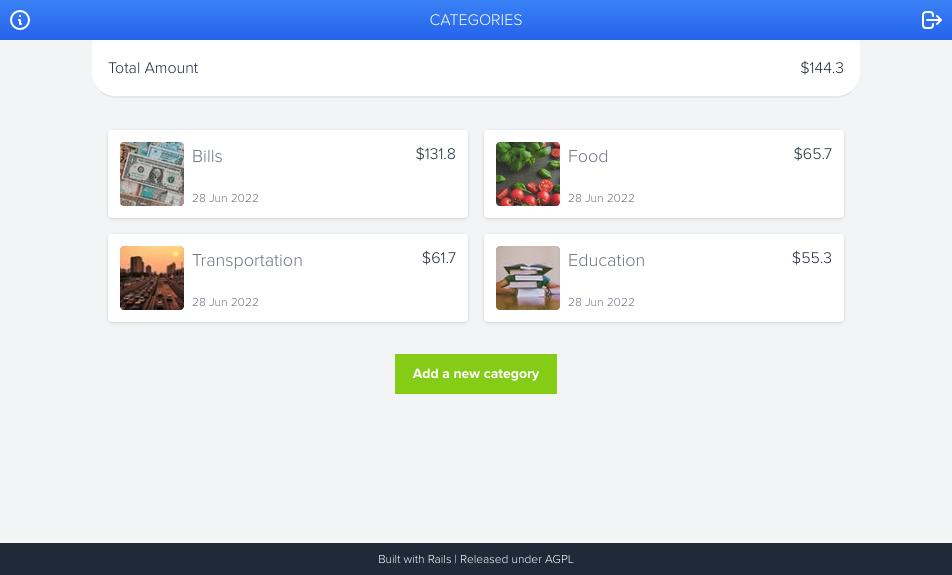

 # Railsment

Railicious is an educational Rails application for tracking payments.

## Built with

- Ruby on Rails
- PostgreSQL
- Tailwind CSS

### Prerequisites

- Ruby 3
- Rails 7
- Postgresql

## Setup

- Clone the Repository
- Run `bundle install`
- To build css files
  - On Gnu/Linux run `./bin/dev`
  - On windows run `rails tailwindcss:build`

### Usage

- Run `rails server` to start the server and start the application. (if you run `./bin/dev` you don't need to run rails server)

## Author

👤 **Mostafa Ahangarha**

- GitHub: [@Mostafa](https://github.com/ahangarha)
- Twitter: [ahangarha](https://twitter.com/ahangarha)
- LinkedIn: [Mostafa](https://www.linkedin.com/in/ahangarha/)

## Contributions

Contributions, issues, and feature requests are welcome!

- Feel free to check the [issues page](https://github.com/ahangarha/Railicious/issues).

### Acknowledgments

- Microverse
- Design is inspired by [Snapscan](https://www.behance.net/gallery/19759151/Snapscan-iOs-design-and-branding)

### 📝 License

This project is AGPL licensed.
